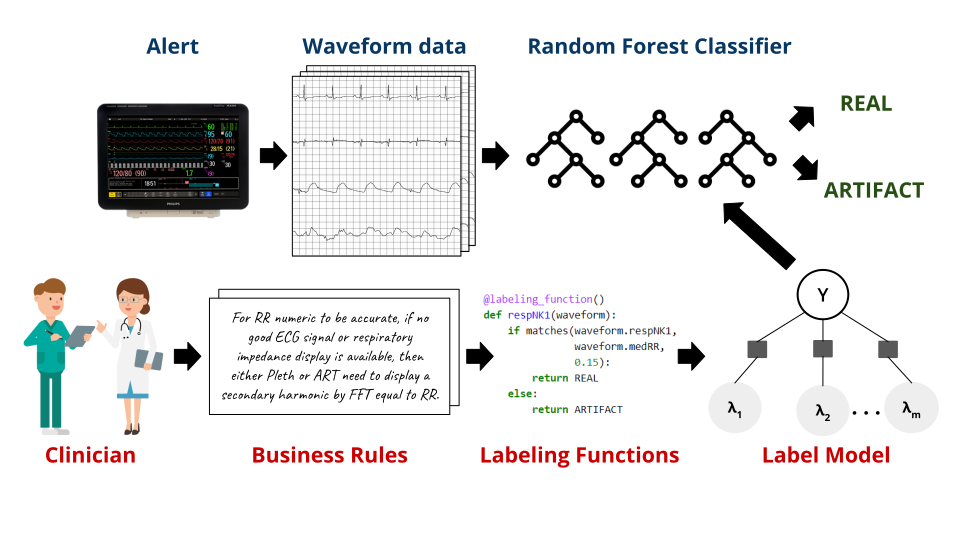
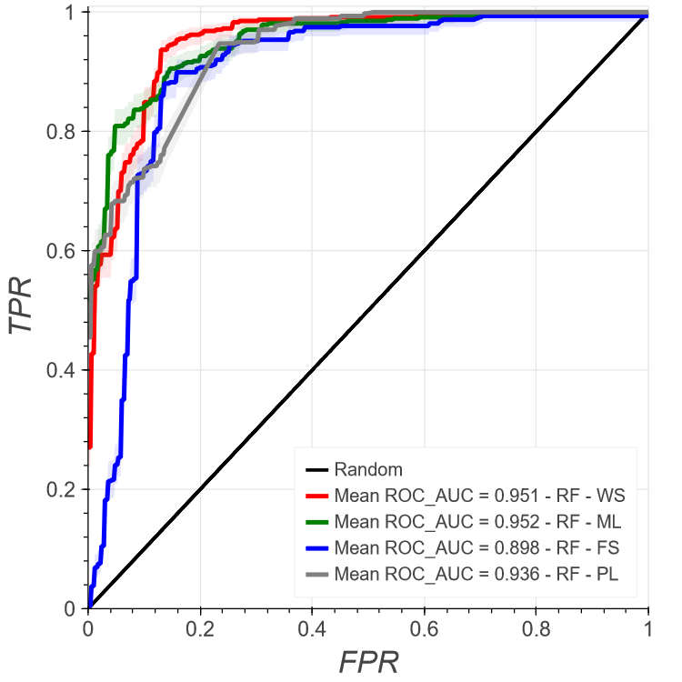
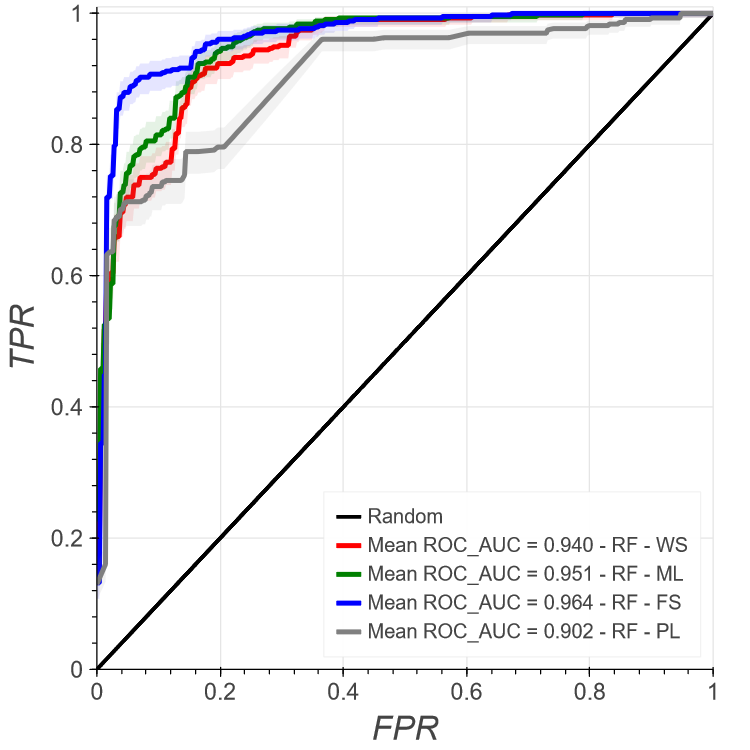

[](https://opensource.org/licenses/MIT)
&nbsp;&nbsp;&nbsp;

# Using Weak Supervision to Predict validity of Vital Sign Alerts as Real or Artifact

## Contents

1. [Overview of Methodology](#methodology) 
2. [Weakly Supervised Methodologies performing on par to Fully Supervised](#results) 
3. [Dataset](#datasets)
4. [Tutorial](#tutorial)
5. [Installation](#installation)
6. [Citation](#citation)
7. [Contributing](#contributing)
8. [License](#license)

<a id="methodology"></a>
## Overview of Methodology 

<p align="center">

</p>

**Figure 1.** Sample weak supervision pipeline for the binary classification of respiratory rate alerts. Heuristics given by domain experts are encoded into labeling functions whose votes are fed into a factor graph. In this case, we show the use of LabelModel [(Ratner et al., 2016)](https://arxiv.org/abs/1605.07723) to generate probabilistic labels. These probabilistic labels are then used for training a downstream real vs. artifact alert Random Forest classifier. 

<a id="results"></a>
## Our Weakly Supervised Models perform on par to our Fully Supervised Baselines
<p align="center">
 
</p> 

**Figures 2 & 3.** The first ROC plot corresponds to analysis for RR alerts, while the second plot corresponds to SpO<sub>2</sub> alerts. In both ROC plots, you can see the weakly supervised model performs comparably to the fully supervised model, and for the RR alerts, it even outperforms the fully supervised model. The weakly supervised models do not have access to ground truth labels, demonstrating weak supervision's ability to add flexibility without sacrificing performance for time series prediction tasks.

<a id="datasets"></a>
## MLADI Dataset

Cardiorespiratory vital sign alert data was collected from a mix of ICU and Step Down Unit (SDU) patients at a large tertiary care research and teaching hospital (University of Pittsburgh Medical Center or UPMC) using the Philips IntelliVue MX800 Monitor. Numerics, including respiratory rate (RR), HR, oxygen saturation (SpO2), and telemetric oxygen saturation (SpO2T) were sampled at 1 Hz. Waveform data, including ECG lead II and lead III, plethysmographs (pleth), telemetric plethysmographs (plethT), arterial pressure waveforms (ART) derived from an indwelling arterial catheter, and respiratory waveforms (resp) from impedance pneumography, were all sampled at various frequencies. ECG lead II and lead III were sampled at both 250 Hz and 500 Hz. Pleth, plethT, and ART were all sampled at 125 Hz, and the resp waveform was sampled at 62.5 Hz.

Although the full private dataset cannot be publicized or shared, some sample data has been included in the github to help readers visualize the data. This sample data can be explored [here](/visualizeData.ipynb)


<a id="tutorial"></a>
## Tutorial Notebook

For a detailed walkthrough of our analysis, we highly recommend viewing this [tutorial notebook](/tutorial.ipynb). The tutorial notebook goes through each step in our weakly supervised pipeline from data formatting and featurization, to downstream classification and evaluation. The tutorial does not focus on the specific details and is meant to help readers familiarize themselves with the process. For specific details, please look through the rest of the code provided in the github.

<a id="installation"></a>
## Installation
We have included the [environment.yml](environment.yml) file so you can recreate the required conda environment
```
$ conda env create -f scripts/environment.yaml
$ conda activate env
```

For more help or specific details, please follow the instructions linked [here](https://conda.io/projects/conda/en/latest/user-guide/tasks/manage-environments.html#creating-an-environment-from-an-environment-yml-file)

<a id="citation"></a>
## Citation

Please cite the following paper if you use any code or methodological design 
```
@article{dey2022weakly,
  title={Weakly supervised classification of vital sign alerts as real or artifact},
  author={Dey, Arnab and Goswami, Mononito and Yoon, Joo Heung and Clermont, Gilles and Pinsky, Michael and Hravnak, Marilyn and Dubrawski, Artur},
  journal={American Medical Informatics Association Annual Symposium},
  year={2022},
}
```
<a id="contributing"></a>
## Contributing

Find `weakVSAlertsAdjudicator` [on GitHub]. We welcome any bug reports and pull requests.

[on GitHub]: https://github.com/autonlab/weakVSAlertsAdjudicator.git

<a id="license"></a>
## License

MIT License

Copyright (c) 2022 Carnegie Mellon University, Auton Lab.

Permission is hereby granted, free of charge, to any person obtaining a copy of this software and associated documentation files (the "Software"), to deal in the Software without restriction, including without limitation the rights to use, copy, modify, merge, publish, distribute, sublicense, and/or sell copies of the Software, and to permit persons to whom the Software is furnished to do so, subject to the following conditions:

The above copyright notice and this permission notice shall be included in all copies or substantial portions of the Software.

THE SOFTWARE IS PROVIDED "AS IS", WITHOUT WARRANTY OF ANY KIND, EXPRESS OR IMPLIED, INCLUDING BUT NOT LIMITED TO THE WARRANTIES OF MERCHANTABILITY, FITNESS FOR A PARTICULAR PURPOSE AND NONINFRINGEMENT. IN NO EVENT SHALL THE AUTHORS OR COPYRIGHT HOLDERS BE LIABLE FOR ANY CLAIM, DAMAGES OR OTHER LIABILITY, WHETHER IN AN ACTION OF CONTRACT, TORT OR OTHERWISE, ARISING FROM, OUT OF OR IN CONNECTION WITH THE SOFTWARE OR THE USE OR OTHER DEALINGS IN THE SOFTWARE.

See [MIT LICENSE](https://github.com/autonlab/weakVSAlertsAdjudicator/blob/main/LICENSE) for details.


 
